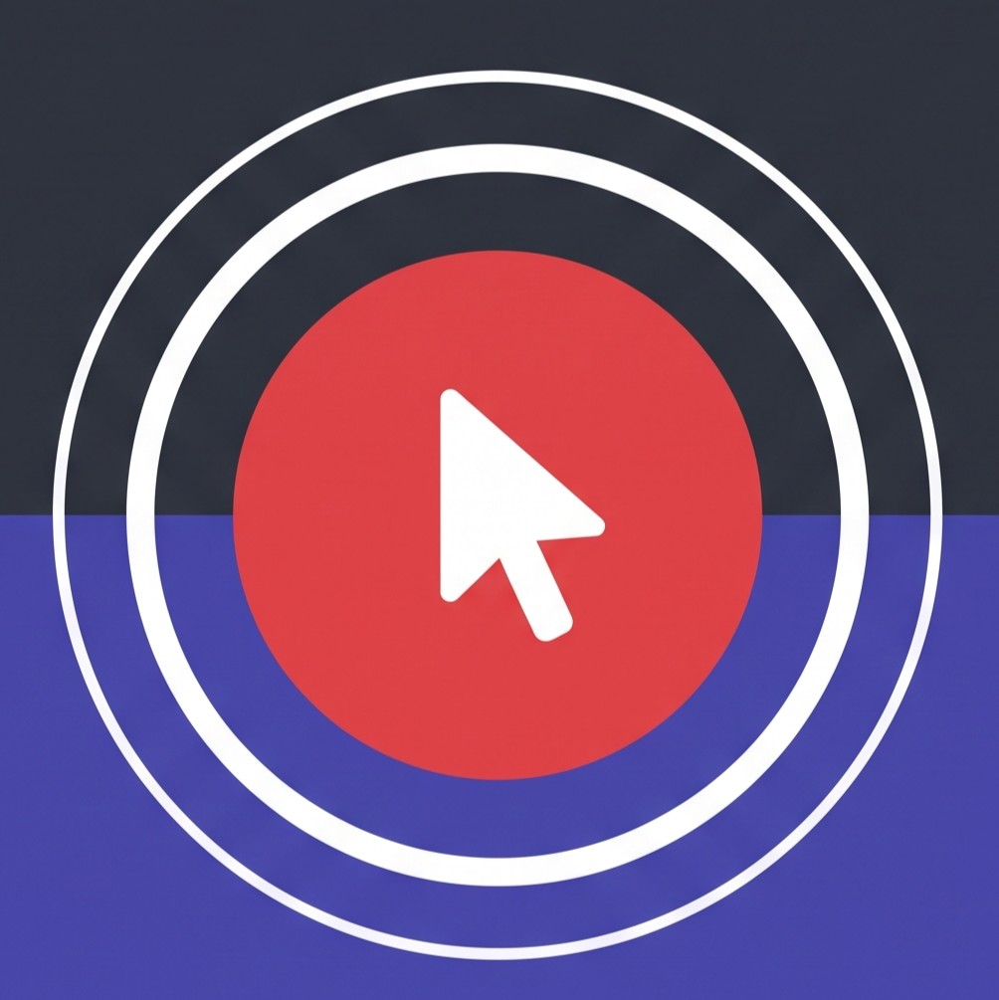

# Mo Rec

<p align="center">
  
</p>

<p align="center">
  
</p>

### Create polished demo videos in minutes
**Mo Rec** is an **open-source screen recorder** and video editor for **walkthroughs, demos, product videos**, and tutorials.

---

## What is Mo Rec?

Mo Rec is a desktop app for recording and editing screen captures with motion-driven presentation tools built in. Instead of sending raw footage to a motion designer just to add zooms, cursor polish, or a styled background, Mo Rec handles that workflow in one place.

---

## Core Features

### Auto-zooms, cursor polish, and styled frames
Mo Rec can automatically emphasize activity with zoom suggestions, smooth cursor movement, add motion effects, and place the final composition inside a styled frame with wallpapers, colors, gradients, blur, padding, and shadows.

### Dynamic webcam bubble overlays
Add webcam footage as an overlay bubble, position it with presets or custom coordinates, mirror it, control shadow and roundness, and optionally make it react to zoom so it stays visually balanced during motion.

### Timeline editing built for demos
Use drag-and-drop timeline tools for zooms, trims, speed regions, annotations, extra audio regions, and crop-aware edits. Save and reopen work as `.morec` project files.

### Extensions & Customization
Mo Rec features an extension architecture supporting custom frames, wallpapers, themes, and render hooks.

---

## New Features

Shipped on `main` — included in the next release build:

- **Motion presets** — dial the automatic motion effects to Off, Subtle, Balanced, or Energetic. Suggestions respect your profile; zooms you add or edit yourself are never changed.
- **One-click silence removal** — "Remove dead air" detects silent gaps in your recording and trims them in a single click, with guards so it never over-cuts or touches your zoom and speed edits.
- **Automatic speed-up of typing and dead air** — long pauses and keyboard bursts become 2× speed regions automatically, so viewers skip the waiting without you touching the timeline.
- **Target file-size export** — set a target in megabytes and MoRec computes the bitrate, with a live size estimate before you commit.
- **Resumable exports** — Lightning exports survive crashes and cancels: finished segments are kept, progress shows `segment i/N`, and the next export offers to resume where it stopped.
- **Audio pre-flight check** — clipping and no-input warnings for your microphone before you record, plus an honest state indicator for system audio.
- **Social canvas presets** — export 9:16, 1:1, or 4:5 versions of your recording (center-cropped, even-normalized) for Shorts, TikTok, and LinkedIn alongside the original.

---

## All Features

### Recording
- Record an entire display or a single app window
- Jump directly from recording into the editor
- Capture microphone audio and system audio
- Use native capture backends where supported
- Resume editing from saved `.morec` project files
- Open existing recordings or existing project files from the app

### Timeline and Editing
- Drag-and-drop timeline editing
- Trim unwanted sections
- Add manual zoom regions
- Use automatic zoom suggestions based on cursor activity
- Add speed-up and slow-down regions
- Add text, image, and figure annotations
- Add extra audio regions on the timeline
- Crop the recorded frame
- Save and reopen projects with editor state preserved

### Cursor Controls
- Show or hide the rendered cursor overlay
- Cursor size adjustment
- Motion smoothing
- Click effects (ripple, spotlight, echo)
- Click bounce and cursor sway

---

## Development

### Prerequisites
- **Node.js 22** (the version used in CI)
- **npm** (ships with Node.js)
- **Git**
- **Windows only:** [VS 2022 Build Tools](https://visualstudio.microsoft.com/downloads/) with the **"Desktop development with C++"** workload — required to compile the whisper runtime and native capture helpers from source

### Setup
```bash
# Install dependencies from the lockfile
npm ci

# Run the dev server
npm run dev

# Run tests
npm test
```

### Build the Windows installer locally
```bash
npm run build:win
```
This compiles the native helpers, then produces the NSIS installer at
`release/Mo Rec-windows-x64.exe`. Run that file to install the app.

The build works fully offline once dependencies are installed (`npm ci` needs
network once; the whisper source tarball is cached in `.tmp/whisper-runtime/`
after the first build). The installed app itself is local-first: no account,
no telemetry, recordings stay on your disk.

Linux installers build with `npm run build:linux`.

Packaging and publishing releases are covered in [RELEASING.md](RELEASING.md).

## Project Documentation
- [CONTRIBUTING.md](CONTRIBUTING.md) — how to fork, test, and open pull requests
- [EXTENSIONS.md](EXTENSIONS.md) — building custom frames, wallpapers, themes, and render hooks
- [RELEASING.md](RELEASING.md) — tagging, packaging, and publishing releases

## Credits

MoRec continues the Recordly project, from which this codebase originates; legacy `.recordly` project files remain fully supported.

MoRec is a modified version of [Recordly](https://github.com/webadderallorg/Recordly) (Copyright (C) 2026 webadderall, AGPL 3.0), which itself started as a fork of the OpenScreen project (Copyright (c) 2025 Siddharth Vaddem, MIT — preserved in [LICENSE.md](LICENSE.md)); legacy `.recordly` project files remain fully supported. MoRec's modifications are Copyright (C) 2026 Mo Rec Contributors, made beginning 2026-08-19, and are released under the same AGPL 3.0 as the rest of the project. See [NOTICE.md](NOTICE.md) for the full modification notice and the licenses of bundled third-party components (including the GPL-licensed ffmpeg binary).

## Download

Prebuilt installers are published on the [Releases](https://github.com/unfoldingdimensions/MoRec/releases) page. Download the installer for your platform, run it, and start recording — the app is local-first and works fully offline after installation. Every release tag is the exact source its binaries were built from, and each release ships `LICENSE.md` and `NOTICE.md` alongside the installers.

## License
Mo Rec is licensed under the **AGPL 3.0** (SPDX: `AGPL-3.0-only`). See [LICENSE.md](LICENSE.md) and [NOTICE.md](NOTICE.md).
